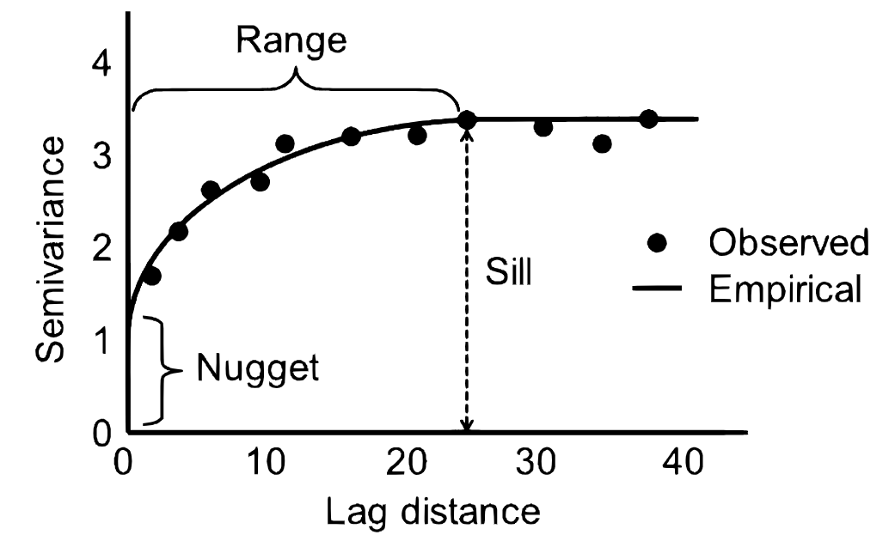
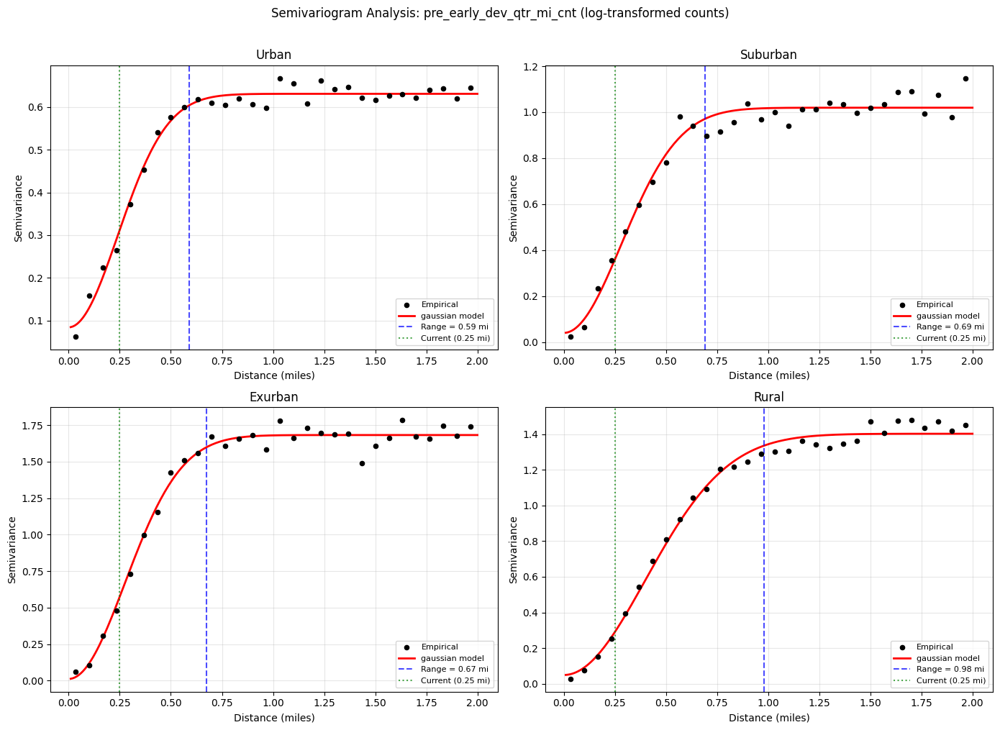

# Semivariogram Analysis: Optimal Distance Radius for Growth Features

**Reference:** https://rpubs.com/bpbond/1206397

## 1. Introduction

### Goal
Determine the optimal distance radius for growth proximity features at the parcel level.

### What "Optimal Distance" Means
The distance should be large enough to include parcels that are part of the same growth event, but small enough to exclude parcels that aren't.

**Example:** A developer buys 50 acres north of Austin and starts building homes. That project has a spatial footprint — all parcels within that footprint share the same growth reality. A parcel on the edge of that footprint (unflagged itself, but surrounded by flagged parcels) should carry the signal — it's desirable for fiber because demand is coming. A parcel 3 miles away in a different part of the county has nothing to do with that development. Including it would be noise.

> **The optimal distance = the typical radius of a growth event's spatial footprint.**

### Approach: Semivariogram Analysis
- For each parcel, we have a count of growth-flagged parcels within 0.25 miles.
- We want to know: at what distance does the spatial correlation of these counts die out? That distance = the natural radius for the proximity feature.
- We do this separately for urban/suburban/exurban/rural to check if the optimal radius varies by density context.

### Measuring Spatial Correlation
Spatial correlation is measured by asking a simple question repeatedly:

> "If I pick two parcels that are *h* miles apart, how different are their growth counts?"

The semivariogram captures the average squared difference of *growth metric counts* between parcel pairs, grouped by how far apart they are.

**Concretely:**
- Parcel A (`pre_early_dev_qtr_mi_cnt = 12`) and Parcel B (`= 10`), 0.1 miles apart → squared difference = (12 − 10)² = 4
- Parcel C (`= 12`) and Parcel D (`= 3`), 0.8 miles apart → squared difference = (12 − 3)² = 81

Do this for all pairs, bin by distance, average the squared differences per bin:
- **Nearby parcels with similar counts** → small squared differences → low semivariance → **high spatial correlation**
- **Distant parcels with unrelated counts** → large squared differences → high semivariance → **no spatial correlation**

The variogram plot is literally "average dissimilarity vs. distance." When it flattens, parcels are no more different from each other than random — they've stopped sharing a common growth context. **That flat point = the radius.**

---

## 2. Empirical Semivariogram Calculation

For each distance bin *h*, the empirical semivariance is:

$$\gamma(h) = \frac{1}{2N(h)} \sum_{(i,j) \in S(h)} (Z(s_i) - Z(s_j))^2$$

Where:
- $N(h)$ = number of parcel pairs whose centroids are approximately *h* miles apart
- $Z(s_i)$ = the log-transformed growth count at parcel *i*
- The sum is over all pairs in the distance bin

This gives one semivariance value per distance bin, forming the empirical variogram points (black dots in the plots).

---

## 3. Fitting a Variogram Model

The empirical points are noisy — we fit a smooth theoretical model to extract a precise range estimate.



**Three parameters are estimated:**
- **Nugget:** The y-intercept; represents micro-scale noise or measurement error
- **Sill:** The plateau value where the curve flattens; equals the overall variance of the data
- **Range:** The distance at which the curve reaches the sill — **this is the answer**

**Model candidates tested:**
| Model | Behavior | When appropriate |
|-------|----------|-----------------|
| Spherical | Reaches sill exactly at range *a* | Sharp spatial boundaries (subdivision edges) |
| Exponential | Approaches sill asymptotically; effective range = 3*a* | Gradual correlation decay |
| Gaussian | Flat near origin, then rises; effective range = √3 × *a* | Smooth transitions between zones |

The best-fitting model (lowest RSS) is selected for each tier.

---

## 4. Log Transform of Features

Growth count features are right-skewed (many zeros, a few very high values). The variogram's squared-difference calculation is sensitive to outliers — a few parcels with count = 50 would dominate.

We apply `log(1 + count)` to:
- Compress the right tail so the variogram reflects *typical* spatial structure
- Handle zeros gracefully (log(1+0) = 0)
- Make the semivariance values more interpretable


## 5. Sampling Strategy

### County Selection

Twenty counties were selected across four density tiers (5 per tier), chosen to represent distinct growth patterns while minimizing within-tier heterogeneity:

| Tier | Counties | Selection Criteria |
|------|----------|-------------------|
| **Urban** | Philadelphia PA, Washington DC, Cook IL, Dallas TX, Los Angeles CA | Uniformly dense; growth = infill/redevelopment; no suburban fringe |
| **Suburban** | Harris TX, Clark NV, Wake NC, Madison AL, Sacramento CA | Active subdivision sprawl at metro edges; classic greenfield expansion |
| **Exurban** | Pinal AZ, Williamson TX, Weld CO, Montgomery TX, Horry SC | Leapfrog development; farmland/ranch converting to master-planned communities |
| **Rural** | Gallatin MT, Yellowstone MT, Ward ND, Laramie WY, Lincoln SD | Sparse growth in large-parcel agricultural/ranch counties; oil/defense/amenity-driven |

Counties were deliberately chosen from different states and geographies to avoid conflating regional trends with density-tier effects.

### Parcel Sampling (5,000 per county)

From each county, 5,000 parcels are sampled using deterministic pseudo-random selection:

```sql
ROW_NUMBER() OVER (
    PARTITION BY fips 
    ORDER BY FARM_FINGERPRINT(CAST(parcel_shape_id AS STRING))
) AS rn
WHERE rn <= 5000
```

- **`FARM_FINGERPRINT`** produces a deterministic hash of the parcel ID — ensuring reproducibility across runs without requiring a stored random seed.
- **5,000 per county / 25,000 per tier** balances computational tractability with statistical power. Each tier yields ~312M potential parcel pairs (25,000 × 24,999 / 2), though only the upper triangle is computed.

- **No spatial bias:** Because the hash is unrelated to location, the sample is spatially uniform within each county (unlike, e.g., sampling the first N rows which might cluster geographically).

### Sub-sampling for Variogram Computation

Within each density tier, a further random sample of **5,000 parcels** is drawn (pooled across the tier's 5 counties) before computing the empirical variogram:

```python
sample = subset.sample(n=min(5000, len(subset)), random_state=42)
```

This yields ~12.5M unique pairs per tier — sufficient for stable bin estimates (typically 10,000–500,000 pairs per lag bin) while keeping computation under ~30 seconds per tier. The random_state=42 ensures reproducibility.

## 6. Results: Pre-Early Development Parcels

### Fitted Semivariograms by Density Tier



### Summary Table
**Feature analyzed:** `pre_early_dev_qtr_mi_cnt` (log1p transformed)  
**Current radius:** 0.25 miles

| Tier | Model | Effective Range (mi) | Nugget | Sill | RSS |
|------|-------|---------------------|--------|--------|----------|
| Urban | Gaussian | 0.589 | 0.084 | 0.6312 | 0.010454 |
| Suburban | Gaussian | 0.691 | 0.0399 | 1.0195 | 0.071672 |
| Exurban | Gaussian | 0.675 | 0.0115 | 1.6826 | 0.099782 |
| Rural | Gaussian | 0.979 | 0.0494 | 1.402 | 0.055623 |

### Interpretation
- **effective_range_miles** = distance where spatial correlation ends (the "size" of a typical development cluster)
- All tiers show range **>> 0.25 miles** → the current quarter-mile radius is missing signal
- Urban/suburban/exurban cluster at **0.59–0.69 miles**; rural is wider at **0.98 miles**
- The Gaussian model fits best across all tiers, suggesting smooth spatial transitions in growth activity (not sharp boundaries)

### Conclusion
A radius of **0.5 miles** would capture the majority of the spatial signal across all density contexts while remaining computationally tractable. The current 0.25-mile radius captures approximately half of the available spatial correlation structure.


## 7. Limitations & Assumptions

### Isotropy Assumption

This analysis computes an **omnidirectional** (isotropic) variogram — it assumes spatial correlation decays at the same rate in all directions. In reality, growth may spread anisotropically (e.g., along highway corridors or coastlines rather than uniformly in all directions).

**Why this is acceptable:**
- **Operational constraint:** The production implementation uses `ST_DWithin` (a circular buffer). A directional radius cannot be applied — the feature is isotropic by construction. The omnidirectional variogram provides the correct input for this geometry.
- **Cross-county pooling:** Each density tier pools 5 counties from different geographies with different dominant growth axes. Averaging across them produces a direction-neutral estimate.
- **Scale:** At 0.5–0.75 miles, we're within individual development clusters. Directional effects (e.g., corridor sprawl) manifest at larger scales (5+ miles).

**Potential validation:** Compute directional variograms (N-S vs. E-W vs. NE-SW vs. NW-SE) for a single county and compare ranges. If they diverge significantly (>2×), anisotropy is material.

### No Trend Removal (Intrinsic Stationarity)

The variogram assumes **second-order stationarity** — that the mean and variance of growth counts don't systematically drift across space. We do not first fit a trend surface and variogram the residuals.

In practice, within a single county there may be a spatial gradient (e.g., more growth activity near the metro edge, less further away). This could slightly inflate the estimated range by conflating local clustering with large-scale trend.

**Why this is acceptable:**
- **Short max distance (2 miles):** County-wide trends spanning 30+ miles contribute negligibly to semivariance at sub-2-mile pair distances.
- **Tier stratification:** Separating urban/suburban/exurban/rural removes the dominant source of systematic spatial trend (density gradient).
- **Cross-county averaging:** Five counties per tier with different trend directions partially cancel each other's bias.
- **Empirical consistency:** The ranges are remarkably stable across tiers (0.59–0.75 mi for `pre_early_dev`), suggesting trend is not inflating them differentially.

**Potential validation:** For a single county, fit `log1p(count) ~ lat + lon` (OLS), then compute the variogram on residuals. If the residual range ≈ the current range, trend is not a confound.

### Non-Normality / Zero-Inflation

The log-transformed feature remains heavily zero-inflated (~70% zeros) and far from Gaussian. The semivariogram does **not** require normality — it is a method-of-moments estimator based on average squared differences. The log transform's purpose is outlier compression (preventing extreme counts from dominating distance bins), not normalization.

The zero-inflation is actually informative: at short lag distances, the variogram captures "how often do nearby parcels disagree on whether growth is occurring?" — which is exactly the spatial structure relevant to the radius question.