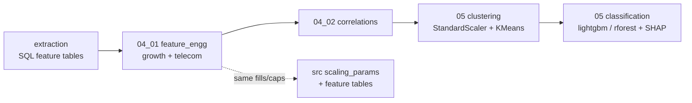
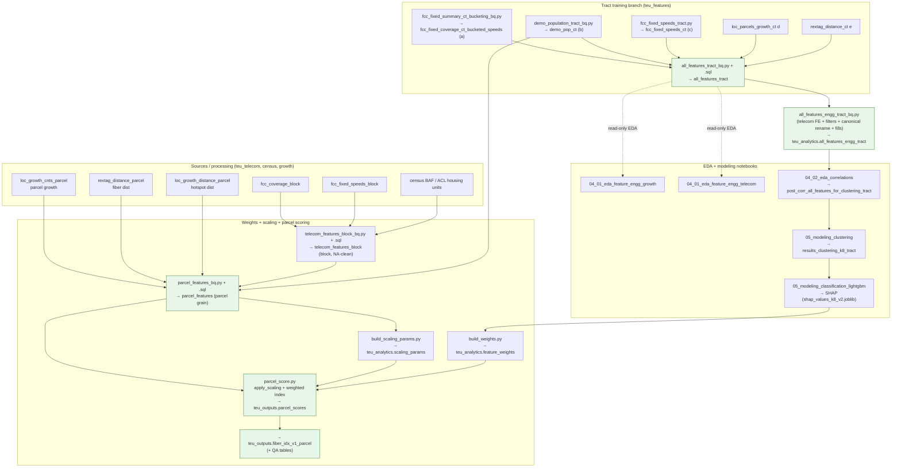

# Repo structure & feature pipeline

This doc describes how tract-level analysis produces the model weights and how those
weights are reused to build the parcel-level index. The two branches never share a
table — they share the **13-feature contract** in `constants.py` and the **rule layer**
(NA fills / winsorize / invert / min-max) in `scoring/scaling.py`.

## High-level flow

## Two-grain architecture

- **Tract branch (training):** exists *only* to derive weights, via clustering + SHAP.
- **Parcel branch (scoring):** reuses those weights + the same fill/scaling constants to
  produce the delivered index.

### Tract feature lineage

`all_features_tract` (raw source, `teu_features`) → `all_features_engg_tract`
(`teu_analytics`, canonical + rule-filled).

- `all_features_tract_bq.py` + `all_features_tract.sql` assemble the raw tract table by
  joining: `fcc_fixed_coverage_ct_bucketed_speeds` (a), `demo_pop_ct` (b),
  `fcc_fixed_speeds_ct` (c), `loc_parcels_growth_ct` (d), `rextag_distance_ct` (e),
  `census_tract_optimized` boundary (f).
- `all_features_engg_tract_bq.py` is the **single writer** of `all_features_engg_tract`:
  it derives the telecom features, applies the row filters (the ~83,313-tract training
  population: drop NA `pop_ch_1yr`/`pop_pctch_1yr`, exclude `estimated_census_housing_units < 50`),
  renames to canonical names, and applies `apply_feature_fills`. This work used to be a
  side-effect of the telecom EDA notebook.

### Smallest-grain feature tables (per family)

| Family | Native grain | Producer | Output table (`teu_features`) |
| --- | --- | --- | --- |
| Growth | parcel | upstream + `parcel_features_bq.py` spine | `loc_growth_cnts_parcel` (+ `rextag_distance_parcel`, `loc_growth_distance_parcel`) |
| FCC / telecom + housing units | block | `telecom_features_block_bq.py` + `telecom_features_block.sql` | `telecom_features_block` (from `fcc_coverage_block` ⋈ `fcc_fixed_speeds_block`) |
| Demographics (pop change) | tract | `demo_population_tract_bq.py` + `demo_population_tract.sql` | `demo_pop_ct` |

All three are broadcast to **parcel grain** in `parcel_features` (`parcel_features.sql`):
block→parcel via `block_id`, tract→parcel via `block_id[:11]`.

### Null handling

- **Block telecom** nulls are handled **in-SQL at build time** in
  `telecom_features_block.sql` via `COALESCE`/`SAFE_DIVIDE` (`cable_penetration→0.0`,
  `fiber_opportunity_gap→1.0`, counts→0, landscape ladder), so `telecom_features_block`
  is already NA-clean before the parcel join.
- **Growth, distances, demo** stay raw (with NaN) into `parcel_features`
  (`parcel_features.sql` deliberately does not fill), and `scoring.scaling.apply_scaling()`
  fills them at score time from `SCALING_NA_FILL_RULES` + the frozen `scaling_params` — the
  same constants `apply_feature_fills()` uses on the tract training table. That shared rule
  layer is the parity guarantee between training and scoring.

> ⚠️ **Drift note:** the block-telecom `COALESCE(...,0.0)`/`COALESCE(...,1.0)` fills
> duplicate the values in `SCALING_NA_FILL_RULES`. They currently match (so `apply_scaling`
> is a no-op for those columns), but if the constant changes, the SQL won't follow. This is
> the one spot outside the single-source-of-truth to keep in sync.

## Detailed pipeline diagram

