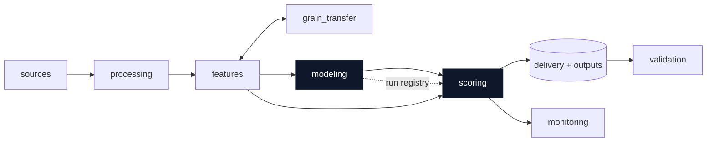
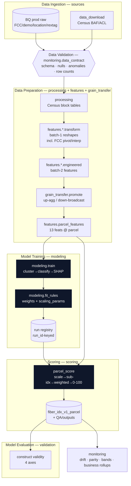
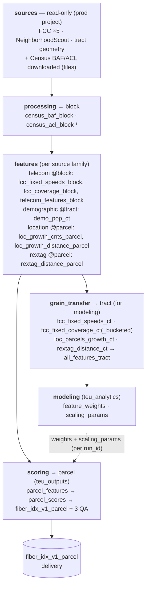

# Repo structure & pipeline architecture (target state)

This document describes the **production-ready target architecture** for the parcel-level
**Fiber Potential Index**. It is the map the rearchitecture is executing toward: the
module spine, the data flow, and — most importantly — **where each piece of logic lives**.

- Vocabulary is fixed in [`../CONTEXT.md`](../CONTEXT.md) (module, grain, transformed vs
  engineered feature, modeling, scoring, monitoring, validation, run registry, …).
- Load-bearing decisions are recorded in [`adr/`](./adr): monitoring↔validation split
  (0001), modeling two-interface seam (0002), BigQuery-prod source-of-truth (0003),
  composite-indicator validation stance (0004).
- The previous (current-state) description is preserved at
  [`repo_structure.prev.md`](docs/archive/repo_structure.prev.md) during migration.

---

## 1. The module spine

Nine purpose-named modules replace the old `data / processing / feature_engg / transfer /
scoring / eda` layout. Each module answers exactly one question; the old `feature_engg`
grab-bag is dissolved.



| Module | One-line purpose | Cadence | Key output tables (dataset) |
| --- | --- | --- | --- |
| `sources` | Ingest raw data behind adapters (ADR-0003) | per refresh | *reads only* — FCC ×5 (`edr_ent_common_reference_ext`), NeighborhoodScout + tract geometry; Census BAF/ACL downloaded (not BQ) |
| `processing` | Reshape the still-downloaded **Census** data → block tables (ADR-0006) | per refresh | `census_baf_block`, `census_acl_block` ¹ |
| `features` | Build features per **source family**, in `transform` + `engineered` layers | per refresh | `fcc_fixed_speeds_block`, `fcc_coverage_block`, `telecom_features_block`; `demo_pop_ct`; `loc_growth_cnts_parcel`, `loc_growth_distance_parcel`; `rextag_distance_parcel` |
| `grain_transfer` | Move features across grains (aggregate-up / broadcast-down) | per refresh | `fcc_fixed_speeds_ct`, `fcc_fixed_coverage_ct(_bucketed)`, `loc_parcels_growth_ct`, `rextag_distance_ct` → `all_features_tract` |
| `modeling` | Derive scoring rules: `train` + `fit_scoring_rules` (ADR-0002) | model ≪ data | `feature_weights`, `scaling_params` (`teu_analytics`) |
| `scoring` | Apply frozen weights + scaling params → index + delivery | per refresh | `parcel_features`, `parcel_scores`, `fiber_idx_v1_parcel` + 3 QA (`teu_outputs`) |
| `monitoring` | Every-run health + data-contract gate + business rollups | every run | *reads outputs* → health/business rollups |
| `validation` | Periodic construct-validity dossier (ADR-0004) | periodic | dossier (no persistent tables yet) |
| `config` / `constants` / `utils` | Shared configuration, the feature contract, helpers | — | — |

¹ Proposed — not yet materialized in BigQuery (currently local parquet). See §8.

### 1.1 `transform` vs `engineered` — the litmus test

Every feature family splits into two layers. The dividing line is **analytical
choice**, not complexity or code volume:

- **`transform`** — a *deterministic reshape* of the raw source to its native grain:
  pivoting, dasymetric interpolation, grain cuts, renames, deduplication. No
  judgment is encoded. Given the raw schema, **two engineers would independently
  produce the identical output**, and the result is fully reproducible from the
  source alone.
- **`engineered`** — *feature definitions chosen during exploratory analysis*:
  thresholds, baseline windows, derived quantities, null-fill and winsorising rules.
  These did **not** exist in the raw data and encode modeling judgment; a different
  analyst could reasonably have chosen differently.

**Litmus test:** *"Would two engineers independently produce the identical output?"*
Yes → `transform`. It encodes an EDA-chosen definition → `engineered`.

Worked examples:
- **demographic / `population_change`** → *engineered*: bakes in the "since 2022"
  baseline, annualisation, the Q3 reference quarter, and which change quantities to
  emit. The raw only has `pop_est_10mile` by year/quarter.
- **location / growth features** → *engineered*: the `is_growth_parcel` rule, the
  ¼-mile count radius, hotspot thresholds (50 flags / variety 10), H3 resolution 7,
  and the 15-mile search cap are all analytical choices absent from the raw parcel
  views.
- **telecom** → has *both*: county→block dasymetric interpolation and the
  copper/cable/fiber pivot are `transform`; `cable_penetration`,
  `fiber_opportunity_gap`, and `provider_competitive_landscape` are `engineered`.

A family whose source already arrives at its native grain and jumps straight to
EDA-chosen definitions (demographic, location) has an **intentionally empty
`transform` layer**.

---

## 2. Target `src/network_idx` tree

```
src/network_idx/
├── config.py                 # env-specific settings (paths, BQ datasets, creds)
├── constants.py              # THE feature contract: 13 features, buckets, invert set,
│                             #   scaling rules, run identity, delivery names
├── utils.py
│
├── sources/                  # ADR-0003 — ingestion behind a single interface
│   ├── __init__.py           #   get_raw(family, ...) — callers don't know the origin
│   ├── bq_prod.py            #   BigQuery-prod adapter (FCC, demographic, location, rextag)
│   └── data_download/        #   dev/backfill adapter (was `data/`)
│       ├── census_baf.py         # Census BAF (still downloaded)
│       ├── census_acl.py         # Census Address Count Listing (still downloaded)
│       ├── fcc_fixed_summary.py  # FCC download — backfill only
│       └── fcc_fixed_speeds.py   # FCC download — backfill only
│
├── processing/               # Census-only reshapes (still download-dependent) — ADR-0006
│   ├── census_baf.py             # block → state/county/tract/place crosswalk
│   └── census_addresscountlisting.py  # housing units per block
│
├── features/                 # split by SOURCE FAMILY; two layers per family
│   ├── parcel_features.py     # assemble family outputs → parcel-grain feature frame
│   │   (+ parcel_features.sql)#   (the scoring input: 13 features @ parcel)
│   ├── telecom/
│   │   ├── transform/         # BATCH 1 — FCC raw (BQ-prod) reshaped to block; no analytical choice
│   │   │   ├── fcc_fixed_speeds.py    # pivot → one wide block row (copper/cable/fiber)
│   │   │   └── fcc_fixed_summary.py   # coverage reshape + dasymetric interpolation → block
│   │   └── engineered/        # BATCH 2 — penetration, opportunity gap, landscape ord, top-tier
│   │       └── telecom_features_block.py (+ .sql)
│   ├── demographic/           # tract-native; pop_ch_avg / pop_pctch_avg (5-yr), housing units
│   │   ├── transform/         (+ demo_population_tract.sql)
│   │   └── engineered/
│   ├── location/              # parcel-native
│   │   ├── transform/
│   │   └── engineered/        # growth counts within qtr-mi, dist-to-nearest-hotspot
│   └── rextag/                # parcel-native
│       ├── transform/
│       └── engineered/        # dist-to-nearest-fiber
│
├── grain_transfer/           # aggregate-up / broadcast-down; SQL generated from a spec
│   ├── promote.py            #   promote(source_table, spec) -> target-grain table
│   ├── specs.py              #   per-family agg (sum/mean/housing-wtd) & broadcast specs
│   └── adapters/
│       ├── bigquery.py       #   prod
│       └── duckdb.py         #   test stand-in (local-substitutable)
│
├── modeling/                 # ADR-0002 — two interfaces; notebooks are thin drivers
│   ├── train.py              #   train(frame) -> model_artifacts (cluster→classify→SHAP)
│   ├── fit_rules.py          #   fit_scoring_rules(frame, shap) -> {weights, scaling_params}
│   └── registry.py           #   run registry: write run_id-keyed artifacts + metadata
│
├── scoring/                  # apply frozen rules; produces index + delivery
│   ├── scaling.py            #   scaling_params fit/apply (the parity layer)
│   ├── weights.py            #   feature_weights read/write
│   ├── build_scaling_params.py   # thin driver over modeling.fit_rules
│   ├── build_weights.py          # thin driver over modeling.fit_rules
│   └── parcel_score.py       #   scale → sub-indices → weighted-avg → 0-100 + delivery
│
├── monitoring/               # every-run health (simple/frequent)
│   ├── data_contract.py      #   INPUT GATE (Q12): schema/null/anomaly/row-count → halt+alert
│   ├── metrics.py            #   null/fill rates, drift vs baseline, train/score parity, bands
│   └── business_rollups.py   #   index-quartile counts, scores>85, per-state rollups (TODO+)
│
└── validation/               # periodic construct-validity dossier (complex/infrequent)
    ├── internal/             # Axis A — sensitivity, coherence/redundancy, spatial, distribution
    ├── external/             # Axis B — ACS, BEAD/RDOF, peer indices (Purdue DDI)
    ├── temporal/             # Axis C — predictive/temporal (needs run-registry snapshots)
    └── expert/               # Axis D — blind expert-review harness

notebooks/                    # THIN DRIVERS ONLY: load frame → call modeling/validation → visualize
```

---

## 3. Data flow (mapped to MLOps pipeline stages)



**Stage map:** Ingestion→`sources` · Data Validation→`monitoring.data_contract` (input
gate) · Data Preparation→`processing`+`features`+`grain_transfer` · Model
Training→`modeling.train` · Model Evaluation→`modeling.fit_rules`+`validation` (no
held-out accuracy — ADR-0004) · Model Registration→**run registry**.

---

## 4. Logic-location table (where each responsibility lives)

| Responsibility | Module / file | Grain | Notes |
| --- | --- | --- | --- |
| Pull raw (prod) | `sources/bq_prod.py` | native | FCC/demo/location/rextag from BQ (ADR-0003) |
| Pull raw (dev/backfill) | `sources/data_download/*` | native | Census always; FCC/others for backfill |
| Input gate | `monitoring/data_contract.py` | — | halt+alert on schema/null/anomaly (Q12) |
| Census block tables | `processing/census_*.py` | block | BAF crosswalk + ACL housing units (ADR-0006) |
| FCC pivot + dasymetric interpolation | `features/telecom/transform/*` | block | **Transformed** features (batch 1); reads FCC from BQ-prod |
| Penetration, gap, landscape ord, top-tier | `features/telecom/engineered/*` | block | **Engineered** features (batch 2) |
| Demographic pop-change (5-yr avg) | `features/demographic/*` | tract | broadcast down to parcel |
| Growth counts, hotspot distance | `features/location/engineered/*` | parcel | aggregate up to block/tract for tract branch |
| Nearest-fiber distance | `features/rextag/engineered/*` | parcel | in **miles** (from BQ distance tables) |
| Grain promotion (up/down) | `grain_transfer/promote.py` + `specs.py` | any→any | SQL from spec; BigQuery + DuckDB adapters |
| Parcel feature assembly | `features/parcel_features.py` (+ .sql) | parcel | the scoring input (13 features) |
| Cluster → classify → SHAP | `modeling/train.py` | tract (training pop) | reruns on model refresh (≈annual) |
| Weights + scaling params | `modeling/fit_rules.py` | tract | reruns on data refresh (≈monthly) |
| Run registry (artifacts + metadata) | `modeling/registry.py` | — | run_id-keyed; backbone for temporal validation |
| Scale + weighted index + delivery | `scoring/parcel_score.py` | parcel | SQL pushdown over ~160M parcels |
| Scaling parity layer | `scoring/scaling.py` + `constants.py` | — | same rules in training & scoring |
| Per-run health metrics | `monitoring/metrics.py` | — | nulls, drift, parity, score bands |
| Business rollups | `monitoring/business_rollups.py` | — | quartiles, >85, per-state (TODO expand) |
| Construct-validity dossier | `validation/{internal,external,temporal,expert}` | — | 4 axes; periodic (ADR-0004) |

---

## 5. Carried-forward contracts (unchanged by the rearchitecture)

These remain the invariants; the rearchitecture relocates *where* they live, not *what*
they are.

- **The 13-feature contract & grain map** (`constants.py`): Growth @ parcel, FCC/telecom
  @ block, Demo @ tract. Canonical order Growth → Telecom → Demo.
- **Training/scoring parity:** the same rule set (na_fill / winsorize / invert / min-max)
  is applied in `modeling.fit_rules` (training) and `scoring.scaling` (scoring), frozen
  per `run_id` in `scaling_params`. This is the parity guarantee — do not fork it.
- **Scored universe ⊃ training population:** the model trains on filtered tracts; scoring
  covers every parcel. NA rules cover degenerate blocks.
- **Weights source of truth:** `constants.py SCORING_BUCKET_WEIGHTS`. (The stale
  `parcel_scoring_qa.md` numbers are to be refreshed after the rewire + rerun.)

---

## 6. Production metrics surface (goal #2)

### 6.1 `monitoring` — every run
1. **Feature null / fill rate** — per feature, incl. inf-as-null.
2. **Raw-vs-clipped drift** — impact of winsorize / domain-bound rules (raw kept in
   `parcel_features`, clipped in scores).
3. **Train/scoring parity** — same rule set both sides; alert on divergence.
4. **Distribution shift** — vs the frozen `run_id` baseline.
5. **Score-band stability** — the 0-25/25-50/50-75/75-100 bands per index.
6. **Join coverage** — CT-vintage / GEOID match rate (QA C2).
7. **Business rollups** — index-quartile parcel counts; parcels scoring >85 per index;
   per-state (block_geoid[:2]) totals + quartile scores. _TODO: expand this set — many
   more business cuts to add._
8. **Data-contract gate** — schema / null / anomaly / row-count pre-conditions (Q12).

### 6.2 `validation` — periodic (four axes, ADR-0004)

| Axis | Test | Metric | Your item |
| --- | --- | --- | --- |
| A internal | Sensitivity (weights/norm/aggr) | rank shift; Spearman ρ | #3 |
| A internal | Redundancy / coherence | sub-index corr; Cronbach α | #4 |
| A internal | Spatial coherence | Moran's I / LISA | #2 |
| A internal | Distribution by context | urban/rural/semi histograms | #1 |
| B external | ACS broadband adoption | rank corr / directional | #5 |
| B external | BEAD/RDOF funding | AUROC; top-decile lift | #6 |
| B external | Peer index (Purdue DDI) | Spearman ρ | — |
| C temporal | Future fiber / funding | temporal AUROC | — |
| D expert | Blind review | weighted κ vs experts | — |

> Full methodology, sources, and pass thresholds: [`validation_methodology.md`](./validation_methodology.md).

---

## 7. Open TODOs

- [ ] Expand `monitoring/business_rollups.py` beyond the seed set (many more business cuts).
- [ ] Refine the `monitoring` ↔ `validation` line and add `validation` sub-modules as the
      dossier grows (ADR-0001 anticipates this).
- [ ] Refresh `constants.py` weights + `parcel_scoring_qa.md` after the rewire and a full rerun.
- [ ] Confirm distance-table units end-to-end (miles) once wiring is complete.
- [ ] Start archiving per-`run_id` feature+score snapshots so the temporal axis (C) is possible.

---

## 8. Data-engineering discussion: tables to persist & test across environments

> **Purpose.** A working agenda for the data-engineering conversation: which BigQuery
> tables the pipeline **materializes** at each stage, which of those to **persist** as a
> source of truth vs. treat as rebuildable intermediates, and which to put under
> **data-contract tests** (schema, row counts, key uniqueness, null/fill rates).
>
> **Environment topology.** Separate GCP projects per environment (**dev / staging /
> prod**). Every stage's datasets exist in each project; the open question below is
> *which* tables are materialized and validated in *which* environment (e.g. transient
> intermediates only in dev, contract-tested tables promoted to staging → prod).

### 8.1 Pipeline stages annotated with the tables they produce



¹ Not yet materialized in BigQuery — see the open questions.

### 8.2 Table inventory by stage

Persist tier — **Raw** (external, read-only) · **Persist** (materialized source of truth for
the next stage) · **Transient** (intermediate, rebuildable). Test priority is the suggested
data-contract coverage.

**Sources — raw, read-only (production project)**

| Table | Dataset | Grain | Tier | Test |
| --- | --- | --- | --- | --- |
| `fcc_copper_fixed_broadband`, `fcc_cable_fixed_broadband`, `fcc_fiber_fixed_broadband` | `edr_ent_common_reference_ext` | location/block | Raw | High (input gate) |
| `fcc_fixed_broadband_geography`, `fcc_fixed_broadband_summary_census` | `edr_ent_common_reference_ext` | block/geo | Raw | High |
| `neighborhood_scout_census_tract` | `edr_ent_property_neighborhood` | tract | Raw | High |
| `vw_country_boundary_sdp_us_census_tract` | `edr_ent_common_reference_data` | tract (geometry) | Raw | Med |
| Census BAF, Census ACL | *downloaded files* | block | Raw (download) | Med |

**Processing — Census → block**

| Table | Dataset | Grain | Tier | Test |
| --- | --- | --- | --- | --- |
| `census_baf_block` ¹ | *TBD* | block | Persist? | High |
| `census_acl_block` ¹ | *TBD* | block | Persist? | High |

**Features — per source family**

| Table | Dataset | Grain | Tier | Test |
| --- | --- | --- | --- | --- |
| `fcc_fixed_speeds_block` | `teu_telecom` | block | Persist | High |
| `fcc_coverage_block` | `teu_telecom` | block | Persist | High |
| `fcc_fixed_speeds_providers_block`, `fcc_fixed_speeds_providers_h3` | `teu_telecom` | block / h3 | Transient | Low |
| `fcc_coverage_county_residuals` | `teu_telecom` | county | Transient | Low |
| `telecom_features_block` | `teu_features` | block | Persist | High |
| `demo_pop_ct` | `teu_features` | tract | Persist | High |
| `loc_growth_cnts_parcel` | `teu_features` | parcel | Persist | High |
| `loc_growth_distance_parcel`, `loc_growth_parcel_concentrations_h3r7` | `teu_features` | parcel / h3 | Persist / Transient | Med / Low |
| `rextag_distance_parcel` | `teu_features` | parcel | Persist | High |

**Grain transfer — → tract (modeling frame)**

| Table | Dataset | Grain | Tier | Test |
| --- | --- | --- | --- | --- |
| `fcc_fixed_speeds_ct` | `teu_features` | tract | Persist | Med |
| `fcc_fixed_coverage_ct`, `fcc_fixed_coverage_ct_bucketed_speeds` | `teu_features` | tract | Persist | Med |
| `loc_parcels_growth_ct` | `teu_features` | tract | Persist | Med |
| `rextag_distance_ct` | `teu_features` | tract | Persist | Med |
| `all_features_tract` | `teu_features` | tract | **Persist** (modeling input) | High |

**Modeling — analytics + artifacts**

| Table | Dataset | Grain | Tier | Test |
| --- | --- | --- | --- | --- |
| `all_feature_engg_tract`, `post_corr_all_features_for_clustering_tract` | `teu_analytics` | tract | Transient (analysis) | Low |
| `results_clustering_k8_tract` | `teu_analytics` | tract | Persist (analysis artifact) | Low |
| `feature_weights` | `teu_analytics` | feature × run | **Persist** (key artifact) | High |
| `scaling_params` | `teu_analytics` | feature × run | **Persist** (key artifact) | High |

**Scoring — parcel + delivery**

| Table | Dataset | Grain | Tier | Test |
| --- | --- | --- | --- | --- |
| `parcel_features` | `teu_features` | parcel | **Persist** (scoring input) | High |
| `parcel_scores` | `teu_outputs` | parcel | Persist | High |
| `fiber_idx_v1_parcel` | `teu_outputs` | parcel | **Persist** (delivery) | High |
| `fiber_idx_v1_parcel_qa_minmax`, `..._qa_fillrates`, `..._qa_index_buckets` | `teu_outputs` | summary | Persist (QA) | Med |

### 8.3 Open questions for the data engineer

1. **Env materialization** — Which tiers are materialized in dev vs staging vs prod? Proposal:
   Transient tables live in dev only; Persist tables are promoted dev → staging → prod once
   contract tests pass. Confirm the promotion path and dataset naming per project.
2. **Census block tables** — Persist `census_baf_block` / `census_acl_block` in BigQuery (which
   dataset + names?), or keep them as parquet and only their downstream FCC-joined products in
   BQ? This is the one gap where a "processing" output is not yet in BQ (ADR-0006).
3. **Data-contract scope** — Which tables get the input gate (schema, row counts, key
   uniqueness, null/fill thresholds) enforced as a hard halt vs. a soft alert? Raw FCC/demo and
   `all_features_tract` / `parcel_features` are the High-priority candidates.
4. **Run versioning & retention** — `feature_weights`, `scaling_params`, `parcel_scores`, and
   `fiber_idx_v1_parcel` are keyed by `run_id`. Partition/cluster by `run_id`? Retention policy
   for old runs (needed for the temporal validation axis)?
5. **Ownership** — Which tables does the DE/platform team own and produce (FCC raw, location
   stored-proc outputs, tract geometry) vs. which the modeling pipeline writes? Draws the
   read/write boundary.
6. **Location & rextag raw** — Confirm the in-house raw table/view names so the `sources`
   registry can be completed (currently a tracked TODO).
