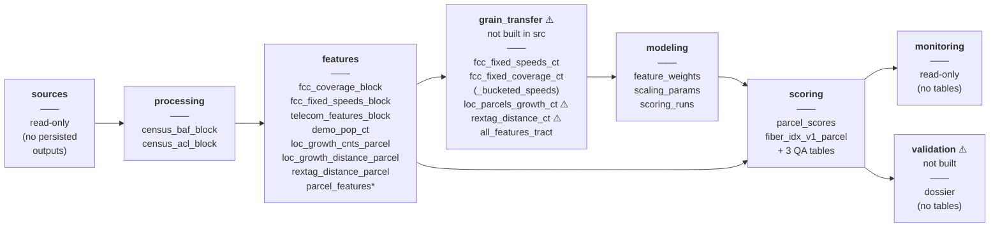

# Repo structure — detailed table inventory (companion to `repo_structure.md`)

> **What this is.** A code-verified, module-by-module inventory of the BigQuery tables the
> pipeline actually writes: fully-qualified names, the source file that produces each, the
> grain, the persistence tier, and — unlike [`repo_structure.md`](./repo_structure.md),
> which describes the **target** architecture — the **build status as of 2026-08-24**
> (what exists in `src` today vs. what is still filled by the legacy `feature_engg/` +
> `transfer/` bridge).
>
> **Relationship to `repo_structure.md`.** That document is the source of truth for the
> module spine, the `transform`/`engineered` split, the logic-location map (§4), and the
> target persist tiers (§8). This companion does **not** restate rationale; it resolves
> §8's target inventory to concrete, verified identifiers and annotates implementation
> status. Where the two could appear to differ, the reconciliation is called out inline.
>
> Project id shown as `PROJECT` (env `GCS_PROJECT_ID`); dataset defaults from
> `config/bigquery.py`. Tables tagged `⚠️` are **not yet produced by any `src` module**.

---

## Persisted tables by module (read each column top-to-bottom)

Only **🟢 persisted** tables are shown here — the durable source-of-truth outputs each
module contributes. Transient intermediates and QA/staging tables are listed in the
detailed sections below.

`*` `parcel_features` is produced by `features/parcel_features.py` (code lives in
`features/`, per `repo_structure.md` §4) but is consumed as the **scoring input**;
`repo_structure.md` §8 groups it under the scoring stage. Same table, two lenses.

**Build status at a glance**

| Module | In `src` today | Notes |
| --- | --- | --- |
| `sources` | ✅ | Census download + BQ-prod adapter |
| `processing` | ✅ | Census → block |
| `features` (telecom/location/rextag/demographic + parcel assembly) | ✅ | all five families migrated |
| `grain_transfer` | ❌ **gap** | still the legacy `feature_engg/` + `transfer/` scripts; 2 CT tables have no producer at all |
| `modeling` | ✅ | `train` + `fit_rules` + `registry` (run registry `scoring_runs` is new) |
| `scoring` | ✅ | rewired to resolve artifacts from the run registry |
| `monitoring` | 🟡 partial | conservation gate + feature distributions/bands done; input gate, score-side metrics, business rollups pending |
| `validation` | ❌ | not built |

---

## 1. `sources` — ingest raw behind adapters (read-only)

No persisted outputs. Reads external production tables (owned by data engineering) and
downloads Census BAF/ACL to files. Tier **Raw**.

| Read | Dataset | Grain |
| --- | --- | --- |
| `fcc_copper_fixed_broadband`, `fcc_cable_fixed_broadband`, `fcc_fiber_fixed_broadband` | `clgx-idap-bigquery-prd-a990.edr_ent_common_reference_ext` | location/block |
| `fcc_fixed_broadband_geography`, `fcc_fixed_broadband_summary_census` | `…edr_ent_common_reference_ext` | geo/place |
| `neighborhood_scout_census_tract` | `…edr_ent_property_neighborhood` | tract |
| `vw_country_boundary_sdp_us_census_tract` (+ block geometry view) | `…edr_ent_common_reference_data` | geometry |
| rextag fiber view *(name TODO — `sources-location-rextag`)* | `…edr_ent_property_energy_infrastructure` | line |
| Census BAF, Census ACL | downloaded `.zip` → local/GCS | block |

---

## 2. `processing` — Census reshape → block

| Produces (fully-qualified) | Grain | Producer | Tier |
| --- | --- | --- | --- |
| `PROJECT.teu_demographics.census_baf_block` | block | `processing/census_blocks_to_bq.py` | 🟢 Persist |
| `PROJECT.teu_demographics.census_acl_block` | block | `processing/census_blocks_to_bq.py` | 🟢 Persist |

> Reconciliation: `repo_structure.md` §8 marks these "Persist? / *TBD* dataset" and flags
> them as the one processing output not yet in BQ (ADR-0006). Verified dataset is
> **`teu_demographics`**; loader exists. Open DE question #2 (materialize vs parquet) stands.

---

## 3. `features` — per source family (`transform` → `engineered`)

### telecom (block grain; FCC inputs are prod, read-only)

| Produces | Grain | Producer | Tier |
| --- | --- | --- | --- |
| `PROJECT.teu_telecom.fcc_coverage_summary` | county/place | `features/telecom/transform/fcc_coverage_summary.py` | 🟡 intermediate |
| `PROJECT.teu_telecom.fcc_coverage_county_residuals` | county | `…/transform/fcc_coverage_county_residuals.py` | 🟡 intermediate |
| `PROJECT.teu_telecom.fcc_coverage_block` | block | `…/transform/fcc_coverage_block.py` (dasymetric interpolation) | 🟢 Persist |
| `PROJECT.teu_telecom.fcc_coverage_block_parity` | block | `…/transform/fcc_coverage_block_oracle.py` | 🔵 transient (one-time parity oracle) |
| `PROJECT.teu_telecom.fcc_fixed_speeds_block` | block | `…/transform/fcc_fixed_speeds_block.py` | 🟢 Persist |
| `PROJECT.teu_features.telecom_features_block` | block | `…/engineered/telecom_features_block.py` (the 4 scored telecom features) | 🟢 Persist |

> Reconciliation: `repo_structure.md` §8 also lists `fcc_fixed_speeds_providers_block` /
> `_providers_h3` under telecom features — those are produced by the **legacy**
> `transfer/fcc_fixed_speeds_and_providers_bq.py`, not the migrated `features/telecom`
> module. Left as transient; revisit when provider data is folded into `features`.

### location (parcel grain)

| Produces | Grain | Producer | Tier |
| --- | --- | --- | --- |
| `PROJECT.teu_features.loc_growth_cnts_parcel` | parcel | `features/location/engineered/growth_counts.py` | 🟢 Persist (expensive spatial join) |
| `PROJECT.teu_features.loc_growth_parcel_concentrations_h3r7` | H3-r7 | `…/engineered/growth_concentrations.py` | 🟡 intermediate |
| `PROJECT.teu_features.loc_growth_distance_parcel` | parcel | `…/engineered/hotspot_distance.py` | 🟢 Persist |

### rextag (parcel grain)

| Produces | Grain | Producer | Tier |
| --- | --- | --- | --- |
| `PROJECT.teu_telecom.int_rextag_fiberopticcables_optimized` | line | `features/rextag/transform/fiber_optimize.py` | 🟡 intermediate |
| `PROJECT.teu_features.rextag_calculation_parcel` | parcel | `features/rextag/engineered/fiber_distance.py` | 🔵 staging |
| `PROJECT.teu_features.rextag_distance_parcel` | parcel | `features/rextag/engineered/fiber_distance.py` | 🟢 Persist |

### demographic (tract grain)

| Produces | Grain | Producer | Tier |
| --- | --- | --- | --- |
| `PROJECT.teu_features.demo_pop_ct` | tract | `features/demographic/engineered/population_change.py` | 🟢 Persist |

### parcel assembly

| Produces | Grain | Producer | Tier |
| --- | --- | --- | --- |
| `PROJECT.teu_features.parcel_features` | **parcel** (13 features, ~160M rows) | `features/parcel_features.py` | 🟢 Persist (scoring input) |

Reads: `loc_growth_cnts_parcel` (parcel) · `telecom_features_block` (block↓) ·
`rextag_distance_parcel` (parcel) · `loc_growth_distance_parcel` (parcel) ·
`demo_pop_ct` (tract↓). Broadcast-down joins on `block_geoid` / `tract_geoid`.

---

## 4. `grain_transfer` — ⚠️ NOT BUILT (target: `promote` + `specs` + adapters)

Currently produced by the **legacy `feature_engg/` + `transfer/`** scripts. This is the
principal remaining structural gap: it feeds the **tract training frame** only.

| Produces | Grain | Producer today | Tier | Status |
| --- | --- | --- | --- | --- |
| `PROJECT.teu_features.fcc_fixed_coverage_ct` | tract | `transfer/fcc_fixed_coverage_features_bq.py` | 🟢 Persist | legacy bridge |
| `PROJECT.teu_features.fcc_fixed_coverage_ct_bucketed_speeds` | tract | `feature_engg/fcc_fixed_summary_ct_bucketing_bq.py` | 🟢 Persist | legacy bridge |
| `PROJECT.teu_features.fcc_fixed_speeds_ct` | tract | `feature_engg/fcc_fixed_speeds_tract.py` + `transfer/…speeds_features_ct_bq.py` | 🟢 Persist | legacy bridge |
| `PROJECT.teu_features.loc_parcels_growth_ct` | tract | **❌ no `src` producer** (notebook/manual) | 🟢 Persist | **missing** |
| `PROJECT.teu_features.rextag_distance_ct` | tract | **❌ no `src` producer** | 🟢 Persist | **missing** |
| `PROJECT.teu_features.all_features_tract` | tract | `feature_engg/all_features_tract_bq.py` | 🟢 Persist (modeling input) | legacy bridge |

Also depends on `PROJECT.boundary.ct_tract_crosswalk_2020` (CT 2020→current GEOID remap)
and `PROJECT.boundary.census_tract_optimized` (tract boundary) — to be registered as
grain_transfer inputs (`grain-transfer-crosswalk`).

> Reconciliation: `repo_structure.md` §8 lists all six as "Persist" (target). No tier
> change here — the addition is **build status**: two have no producer anywhere in the
> repo, which is the concrete case for building `grain_transfer`.

---

## 5. `modeling` — fit scoring rules (ADR-0002)

| Produces | Grain | Producer | Tier |
| --- | --- | --- | --- |
| `PROJECT.teu_analytics.all_feature_engg_tract` | tract | `feature_engg/all_features_engg_tract_bq.py` (legacy; superseded once `train` reads `all_features_tract` directly) | 🔵 transient (analysis) |
| `PROJECT.teu_analytics.results_clustering_k8_tract` | tract | modeling / notebook artifact | 🟡 analysis artifact |
| model + SHAP joblibs `notebooks/data/{shap_values,X_shap}_k8_lightgbm_v1.joblib` | — | `modeling/train.py` | 🟢 versioned artifact |
| `PROJECT.teu_analytics.feature_weights` (per `run_id`) | feature × run | `scoring/build_weights.py` → `modeling.fit_rules` | 🟢 **Persist (key artifact)** |
| `PROJECT.teu_analytics.scaling_params` (per `run_id`) | feature × run | `scoring/build_scaling_params.py` → `modeling.fit_rules` | 🟢 **Persist (key artifact)** |
| `PROJECT.teu_analytics.scoring_runs` (per `run_id`) | run | `modeling/registry.py` | 🟢 Persist (**new** run registry) |

> `scoring_runs` is additive to `repo_structure.md` §8 — the run ledger (model, k,
> version, artifact table refs) that makes scoring self-describing.

---

## 6. `scoring` — apply frozen rules → index + delivery

| Produces | Grain | Producer | Tier |
| --- | --- | --- | --- |
| `PROJECT.teu_outputs.parcel_scores` | parcel | `scoring/parcel_score.py :: run` | 🟢 Persist |
| `PROJECT.teu_outputs.fiber_idx_v1_parcel` | parcel | `scoring/parcel_score.py :: run_delivery` | 🟢 **Persist (delivery)** |
| `PROJECT.teu_outputs.fiber_idx_v1_parcel_qa_minmax` | summary | `…:: run_qa` | 🔵 QA |
| `PROJECT.teu_outputs.fiber_idx_v1_parcel_qa_fillrates` | summary | `…:: run_qa` | 🔵 QA |
| `PROJECT.teu_outputs.fiber_idx_v1_parcel_qa_index_buckets` | summary | `…:: run_qa` | 🔵 QA |

Scoring resolves *which* `feature_weights` / `scaling_params` tables to read from the
`scoring_runs` registry (falls back to configured defaults for pre-registry runs).

---

## 7. `monitoring` — read-only (writes no tables)

Returns health dataclasses / flags; halts on the data-contract gate. No persisted
outputs. Partial today: dasymetric conservation gate + telecom feature
distributions/band counts done; input gate, score-side drift/parity, and
`business_rollups` still pending.

## 8. `validation` — ⚠️ NOT BUILT

Periodic construct-validity dossier (4 axes, ADR-0004). No persistent tables yet.

---

## Persist-tier summary (for the DE conversation)

- 🟢 **Persist (source of truth):** `census_baf_block`, `census_acl_block`;
  `fcc_coverage_block`, `fcc_fixed_speeds_block`, `telecom_features_block`, `demo_pop_ct`,
  `loc_growth_cnts_parcel`, `loc_growth_distance_parcel`, `rextag_distance_parcel`,
  `parcel_features`; all `*_ct` + `all_features_tract`; `feature_weights`,
  `scaling_params`, `scoring_runs`; `parcel_scores`, `fiber_idx_v1_parcel`.
- 🟡 **Rebuildable intermediate:** `fcc_coverage_summary`, `fcc_coverage_county_residuals`,
  `int_rextag_fiberopticcables_optimized`, `loc_growth_parcel_concentrations_h3r7`,
  `all_feature_engg_tract`, `results_clustering_k8_tract`.
- 🔵 **Transient / staging / QA:** `fcc_coverage_block_parity`, `rextag_calculation_parcel`,
  the three `fiber_idx_v1_parcel_qa_*`.
- ⚪ **External (data-eng owned, read-only):** all `clgx-idap-…prd-a990.*` FCC / neighborhood
  / geometry / rextag tables.

Open DE questions carry over from [`repo_structure.md`](./repo_structure.md) §8.3
(env materialization, Census block persistence, contract-test scope, `run_id`
partitioning/retention, read/write ownership, rextag raw naming).
