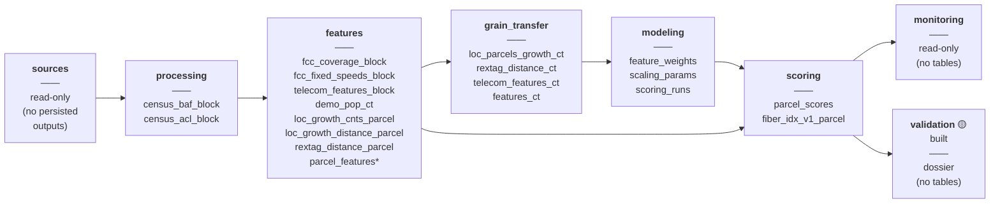
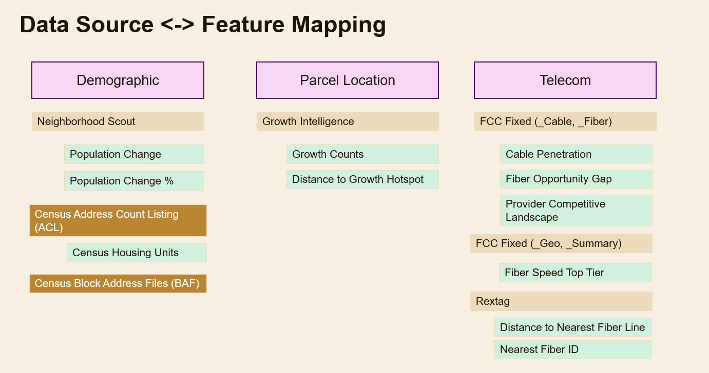

# Repo structure — detailed table inventory (companion to `repo_structure.md`)

> **What this is.** A code-verified, module-by-module inventory of the BigQuery tables the
> pipeline actually writes: fully-qualified names, the source file that produces each, the
> grain, the persistence tier, and — unlike [`repo_structure.md`](./repo_structure.md),
> which describes the **target** architecture — the **build status as of 2026-10-08**
> (what exists in `src` today vs. what is still filled by the legacy `feature_engg/` +
> `transfer/` bridge).
>
> Every BigQuery compute step below is also emitted as runnable SQL under
> [`sql/`](../sql/README.md); that README's numbered run order (steps 1–19) is the
> execution contract, and the step numbers are cited inline here.
>
> **Relationship to `repo_structure.md`.** That document is the source of truth for the
> module spine, the `transform`/`engineered` split, the logic-location map (§4), and the
> target persist tiers (§8). This companion does **not** restate rationale; it resolves
> §8's target inventory to concrete, verified identifiers and annotates implementation
> status. Where the two could appear to differ, the reconciliation is called out inline.
>
> Project id shown as `PROJECT` (env `GCS_PROJECT_ID`); dataset defaults from
> `config/bigquery.py`. Tables tagged `⚠️` are **not yet produced by any `src` module**.

---

## Persisted tables by module (read each column top-to-bottom)

Only **🟢 persisted** tables are shown here — the durable source-of-truth outputs each
module contributes. Transient intermediates and QA/staging tables are listed in the
detailed sections below.

```mermaid
flowchart LR
  SRC["<b>sources</b><br/>——<br/>read-only<br/>(no persisted<br/>outputs)"]
  PROC["<b>processing</b><br/>——<br/>census_baf_block<br/>census_acl_block"]
  FEAT["<b>features</b><br/>——<br/>fcc_coverage_block<br/>fcc_fixed_speeds_block<br/>telecom_features_block<br/>demo_pop_ct<br/>loc_growth_cnts_parcel<br/>loc_growth_distance_parcel<br/>rextag_distance_parcel<br/>parcel_features*"]
  GT["<b>grain_transfer</b><br/>——<br/>loc_parcels_growth_ct<br/>rextag_distance_ct<br/>telecom_features_ct<br/>features_ct"]
  MODEL["<b>modeling</b><br/>——<br/>feature_weights<br/>scaling_params<br/>scoring_runs"]
  SCORE["<b>scoring</b><br/>——<br/>parcel_scores<br/>fiber_idx_v1_parcel"]
  MON["<b>monitoring</b><br/>——<br/>read-only<br/>(no tables)"]
  VAL["<b>validation</b> 🟡<br/>built<br/>——<br/>dossier<br/>(no tables)"]

  SRC --> PROC --> FEAT --> GT --> MODEL --> SCORE --> MON
  FEAT --> SCORE
  SCORE --> VAL
```

`*` `parcel_features` is produced by `features/parcel_features.py` (code lives in
`features/`, per `repo_structure.md` §4) but is consumed as the **scoring input**;
`repo_structure.md` §8 groups it under the scoring stage. Same table, two lenses.

**Build status at a glance**

| Module | In `src` today | Notes |
| --- | --- | --- |
| `sources` | ✅ | Census download + BQ-prod adapter |
| `processing` | ✅ | Census → block |
| `features` (telecom/location/rextag/demographic + parcel assembly) | ✅ | all five families migrated |
| `grain_transfer` | ✅ | all four CT tables produced by `src` runners with committed SQL (steps 12–15); legacy bridge retired |
| `modeling` | ✅ | `run_training` driver → `fit_rules` + `registry` + JSON run artifact |
| `scoring` | ✅ | rewired to resolve artifacts from the run registry; QA path retired in favour of `monitoring` |
| `monitoring` | 🟢 | conservation gate + feature distributions/bands + business rollups + drift (vs `monitoring_baseline`) + train/scoring parity all built |
| `validation` | 🟡 | four-axis construct-validity kernels built + tested (internal/external/temporal/expert + dossier); external-data loaders and archived-snapshot wiring deferred |

---

## 1. `sources` — ingest raw behind adapters (read-only)

No persisted outputs. Reads external production tables (owned by data engineering) and
downloads Census BAF/ACL to files. Tier **Raw**.

| Read | Dataset | Grain |
| --- | --- | --- |
| `fcc_copper_fixed_broadband`, `fcc_cable_fixed_broadband`, `fcc_fiber_fixed_broadband` | `clgx-idap-bigquery-prd-a990.edr_ent_common_reference_ext` | location/block |
| `fcc_fixed_broadband_geography`, `fcc_fixed_broadband_summary_census` | `…edr_ent_common_reference_ext` | geo/place |
| `neighborhood_scout_census_tract` | `…edr_ent_property_neighborhood` | tract |
| `vw_country_boundary_sdp_us_census_tract` (+ block geometry view) | `…edr_ent_common_reference_data` | geometry |
| rextag fiber view *(name TODO — `sources-location-rextag`)* | `…edr_ent_property_energy_infrastructure` | line |
| Census BAF, Census ACL | downloaded `.zip` → local/GCS | block |

---

## 2. `processing` — Census reshape → block

| Produces (fully-qualified) | Grain | Producer | Tier |
| --- | --- | --- | --- |
| `PROJECT.teu_demographics.census_baf_block` | block | `processing/census_blocks_to_bq.py` | 🟢 Persist |
| `PROJECT.teu_demographics.census_acl_block` | block | `processing/census_blocks_to_bq.py` | 🟢 Persist |

> Reconciliation: `repo_structure.md` §8 marks these "Persist? / *TBD* dataset" and flags
> them as the one processing output not yet in BQ (ADR-0006). Verified dataset is
> **`teu_demographics`**; loader exists. Open DE question #2 (materialize vs parquet) stands.

---

## 3. `features` — per source family (`transform` → `engineered`)

### telecom (block grain; FCC inputs are prod, read-only)

| Produces | Grain | Producer | Tier |
| --- | --- | --- | --- |
| `PROJECT.teu_telecom.fcc_coverage_summary` | county/place | `features/telecom/transform/fcc_coverage_summary.py` | 🟡 intermediate |
| `PROJECT.teu_telecom.fcc_coverage_county_residuals` | county | `…/transform/fcc_coverage_county_residuals.py` | 🟡 intermediate |
| `PROJECT.teu_telecom.fcc_coverage_block` | block | `…/transform/fcc_coverage_block.py` (dasymetric interpolation) | 🟢 Persist |
| `PROJECT.teu_telecom.fcc_coverage_block_parity` | block | `…/transform/fcc_coverage_block_oracle.py` | 🔵 transient (one-time parity oracle) |
| `PROJECT.teu_telecom.fcc_fixed_speeds_block` | block | `…/transform/fcc_fixed_speeds_block.py` | 🟢 Persist |
| `PROJECT.teu_features.telecom_features_block` | block | `…/engineered/telecom_features_block.py` (the 4 scored telecom features) | 🟢 Persist |

> Reconciliation: `repo_structure.md` §8 also lists `fcc_fixed_speeds_providers_block` /
> `_providers_h3` under telecom features — those are produced by the **legacy**
> `transfer/fcc_fixed_speeds_and_providers_bq.py`, not the migrated `features/telecom`
> module. Left as transient; revisit when provider data is folded into `features`.

### location (parcel grain)

| Produces | Grain | Producer | Tier |
| --- | --- | --- | --- |
| `PROJECT.teu_features.loc_growth_cnts_parcel` | parcel | `features/location/engineered/growth_counts.py` | 🟢 Persist (expensive spatial join) |
| `PROJECT.teu_features.loc_growth_parcel_concentrations_h3r7` | H3-r7 | `…/engineered/growth_concentrations.py` | 🟡 intermediate |
| `PROJECT.teu_features.loc_growth_distance_parcel` | parcel | `…/engineered/hotspot_distance.py` | 🟢 Persist |

### rextag (parcel grain)

| Produces | Grain | Producer | Tier |
| --- | --- | --- | --- |
| `PROJECT.teu_telecom.int_rextag_fiberopticcables_optimized` | line | `features/rextag/transform/fiber_optimize.py` | 🟡 intermediate |
| `PROJECT.teu_features.rextag_calculation_parcel` | parcel | `features/rextag/engineered/fiber_distance.py` | 🔵 staging |
| `PROJECT.teu_features.rextag_distance_parcel` | parcel | `features/rextag/engineered/fiber_distance.py` | 🟢 Persist |

### demographic (tract grain)

| Produces | Grain | Producer | Tier |
| --- | --- | --- | --- |
| `PROJECT.teu_features.demo_pop_ct` | tract | `features/demographic/engineered/population_change.py` | 🟢 Persist |

### parcel assembly

| Produces | Grain | Producer | Tier |
| --- | --- | --- | --- |
| `PROJECT.teu_features.parcel_features` | **parcel** (13 features, ~160M rows) | `features/parcel_features.py` | 🟢 Persist (scoring input) |

Reads: `loc_growth_cnts_parcel` (parcel) · `telecom_features_block` (block↓) ·
`rextag_distance_parcel` (parcel) · `loc_growth_distance_parcel` (parcel) ·
`demo_pop_ct` (tract↓). Broadcast-down joins on `block_geoid` / `tract_geoid`.

---

## 4. `grain_transfer` — ✅ BUILT (four CT runners, SQL-generating)

The module is complete. Four runners under `src/network_idx/grain_transfer/` produce the
tract-grain tables, each emitting its BigQuery SQL via `--dry-run` into
[`sql/grain_transfer/`](../sql/grain_transfer) (steps **12–15** of the `sql/README.md` run
order). The legacy `feature_engg/` + `transfer/` CT bridge is **retired**: the three
`fcc_fixed_*_ct` tables and `all_features_tract` are no longer produced or read.

This module feeds the **tract training frame** only — `features_ct` is what
`modeling/run_training.py` fits on.

| Produces (fully-qualified) | Grain | Producer | Step | Tier |
| --- | --- | --- | --- | --- |
| `PROJECT.teu_features.loc_parcels_growth_ct` | tract | `grain_transfer/location_growth_ct.py` (port of `create_parcel_growth_agg_ct`) | 12 | 🟢 Persist |
| `PROJECT.teu_features.rextag_distance_ct` | tract | `grain_transfer/rextag_distance_ct.py` (port of `create_fiber_agg_ct`) | 13 | 🟢 Persist |
| `PROJECT.teu_features.telecom_features_ct` | tract | `grain_transfer/fcc_features_ct.py` | 14 | 🟢 Persist |
| `PROJECT.teu_features.features_ct` | tract | `grain_transfer/features_ct.py` | 15 | 🟢 **Persist (modeling input)** |

**How each one reaches tract grain** — three different mechanisms, worth keeping straight:

- `loc_parcels_growth_ct` and `rextag_distance_ct` aggregate **parcel → tract** by a
  *spatial join* of the parcel centroid against the tract-boundary geometry (deduplicated
  to one tract per parcel), not by a block-id crosswalk.
- `telecom_features_ct` rolls **block → tract** inputs and then applies the *same*
  engineered-feature definition as the block table. Both `telecom_features_block` (step 5)
  and `telecom_features_ct` render the shared `telecom_features.sql` body; each caller
  supplies only a `joined_prelude` CTE with the per-grain inputs. This is what makes
  block and tract telecom features structurally unable to drift (**ADR-0007**).
- `features_ct` is pure assembly — the tract-grain analogue of `parcel_features`. It joins
  every family's tract output into one row per tract carrying the **same thirteen model
  features** as `parcel_features`, which is the train/score parity contract.

Two properties of `features_ct` that matter downstream:

- **`telecom_features_ct` is the join spine**; growth, rextag-distance, and `demo_pop_ct`
  are LEFT JOINed, so a tract is never dropped because one family has no row for it. All
  tracts are emitted — the training-population filter is applied in `modeling`, not here.
- **Null fills are deliberately not applied.** The frame preserves genuine missingness;
  `modeling` fills each feature per the scoring contract. (See `docs/QA.md` QA-1 — where
  those fills land is an open data-quality issue.)

Columns are aliased to the **model** names (the keys of `MODEL_TO_SCORING_FEATURE`) so
`train.py` renames them to canonical scoring names in one step.

> Reconciliation: `repo_structure.md` §8 previously carried a six-table CT inventory
> (`fcc_fixed_speeds_ct`, `fcc_fixed_coverage_ct`, `fcc_fixed_coverage_ct_bucketed_speeds`,
> `all_features_tract`, plus the two parcel→tract tables). The three FCC CT tables
> collapsed into the single `telecom_features_ct` and `all_features_tract` was replaced by
> `features_ct`; **`repo_structure.md` §8 has been updated to match** (2026-10-08). Tiers
> are unchanged.
>
> ✅ Resolved: the earlier drift note — `rextag_distance_ct` emitting
> `dist_to_nearest_fiber_m` (metres) while the rearchitected rextag feature emits miles —
> no longer applies; `features_ct` consumes the miles-denominated column.
>
> `promote.py` / `specs.py` / `adapters/` remain in the module as the spec-driven
> block→tract helper; the four shipped runners are bespoke SQL, so `promote` is currently
> **unused by the production path**.

---

## 5. `modeling` — fit scoring rules (ADR-0002)

`modeling/run_training.py` is the single driver: load `features_ct` → fit → write the JSON
run artifact → write `feature_weights` / `scaling_params` → register the run. `--dry-run`
rehearses the whole thing and skips every write.

| Produces | Grain | Producer | Tier |
| --- | --- | --- | --- |
| `artifacts/runs/<run_id>.json` (weights, scaling params, fit metrics, source table, code version) | run | `modeling/artifacts.py` | 🟢 versioned artifact |
| `PROJECT.teu_analytics.feature_weights` (per `run_id`) | feature × run | `modeling/run_training.py` → `scoring/weights.py :: write_feature_weights` | 🟢 **Persist (key artifact)** |
| `PROJECT.teu_analytics.scaling_params` (per `run_id`) | feature × run | `modeling/run_training.py` → `scoring/scaling.py :: write_scaling_params` | 🟢 **Persist (key artifact)** |
| `PROJECT.teu_analytics.scoring_runs` (per `run_id`) | run | `modeling/registry.py` | 🟢 Persist (run registry) |

`modeling/train.py` fits the model and returns SHAP values **in memory**;
`modeling/cluster_metrics.py` likewise computes cluster diagnostics (inertia, silhouette,
Davies–Bouldin, Calinski–Harabasz) and returns them — neither persists anything. The run
JSON is the durable record of a fit.

Both rule tables are written **delete-then-append by `run_id`**, so multiple runs coexist
in one table and scoring selects by `run_id`.

> `scoring_runs` is additive to `repo_structure.md` §8 — the run ledger (model, k,
> version, artifact table refs) that makes scoring self-describing.
>
> ⚠️ Stale config: `config/bigquery.py` still defines
> `BQ_CLUSTERING_TRACTS = "results_clustering_k8_tract"` and
> `BQ_FEATURES_ENGG_TRACT = "all_feature_engg_tract"`. **No `src` module writes or reads
> either table** — they are leftovers of the notebook/legacy era and are candidates for
> removal.
>
> Retired: `scoring/build_weights.py`. Weight extraction now lives in
> `modeling.fit_rules`, driven by `run_training`, and the model is fit directly on
> `features_ct`. `modeling/policy_lab.py` + `diagnostics.py` are the offline refit/
> what-if harness (not part of the production path) — they are what `docs/QA.md`'s
> refit grids are run through.

---

## 6. `scoring` — apply frozen rules → index + delivery

| Produces | Grain | Producer | Step | Tier |
| --- | --- | --- | --- | --- |
| `PROJECT.teu_analytics.scaling_params` (country-wide scan) | feature | `scoring/build_scaling_params.py` | 17 | 🟢 Persist |
| `PROJECT.teu_outputs.parcel_scores` | parcel | `scoring/parcel_score.py :: run` | 18 | 🟢 Persist |
| `PROJECT.teu_outputs.fiber_idx_v1_parcel` | parcel | `scoring/parcel_score.py :: run_delivery` | 19 | 🟢 **Persist (delivery)** |

Scoring resolves *which* `feature_weights` / `scaling_params` tables to read from the
`scoring_runs` registry (falls back to configured defaults for pre-registry runs).

The **delivery** table is deliberately self-reconciling: it publishes all thirteen scaled
features alongside their within-bucket weights and the three bucket weights, so a consumer
can recompute the index from the row itself. Any adjustment applied to a sub-index but not
visible in those columns would break that property — see `docs/QA.md` QA-1.

> Retired: `parcel_score.py :: run_qa` and the three `fiber_idx_v1_parcel_qa_*` tables
> (`_minmax`, `_fillrates`, `_index_buckets`). Those checks now live in `monitoring`
> (`metrics.py` distributions/bands, `data_contract.py` fill gate, `parity.py`), which
> returns dataclasses rather than persisting QA tables.

---

## 7. `monitoring` — read-only (writes no tables)

Returns health dataclasses / flags; halts on the data-contract gate. No persisted outputs.
Built: `data_contract.py` (conservation + input gate), `metrics.py` (feature
distributions/bands), `drift.py` (vs a baseline snapshot), `parity.py` (train/scoring
parity), `business_rollups.py`.

## 8. `validation` — 🟡 PARTLY BUILT

Periodic construct-validity dossier (4 axes, ADR-0004). No persisted tables. Built:
`validation/internal/` (`distribution`, `spatial`, `coherence`, `sensitivity`),
`validation/external/anchors.py`, `validation/temporal/backtest.py`,
`validation/expert/review.py`, and `validation/dossier.py` as the assembler. Deferred:
external-data loaders (ACS, BEAD) and archived-snapshot wiring for the temporal axis.

---

## Persist-tier summary (for the DE conversation)

- 🟢 **Persist (source of truth):** `census_baf_block`, `census_acl_block`;
  `fcc_coverage_block`, `fcc_fixed_speeds_block`, `telecom_features_block`, `demo_pop_ct`,
  `loc_growth_cnts_parcel`, `loc_growth_distance_parcel`, `rextag_distance_parcel`,
  `parcel_features`; `loc_parcels_growth_ct`, `rextag_distance_ct`, `telecom_features_ct`,
  `features_ct`; `feature_weights`, `scaling_params`, `scoring_runs`; `parcel_scores`,
  `fiber_idx_v1_parcel`.
- 🟡 **Rebuildable intermediate:** `fcc_coverage_summary`, `fcc_coverage_county_residuals`,
  `int_rextag_fiberopticcables_optimized`, `loc_growth_parcel_concentrations_h3r7`.
- 🔵 **Transient / staging:** `fcc_coverage_block_parity`, `rextag_calculation_parcel`.
- ⚪ **External (data-eng owned, read-only):** all `clgx-idap-…prd-a990.*` FCC / neighborhood
  / geometry / rextag tables.
- ⛔ **Retired (no longer produced or read):** `all_features_tract`,
  `all_feature_engg_tract`, `fcc_fixed_coverage_ct`,
  `fcc_fixed_coverage_ct_bucketed_speeds`, `fcc_fixed_speeds_ct`,
  `results_clustering_k8_tract`, and the three `fiber_idx_v1_parcel_qa_*` tables.

Open DE questions carry over from [`repo_structure.md`](./repo_structure.md) §8.3
(env materialization, Census block persistence, contract-test scope, `run_id`
partitioning/retention, read/write ownership, rextag raw naming).
