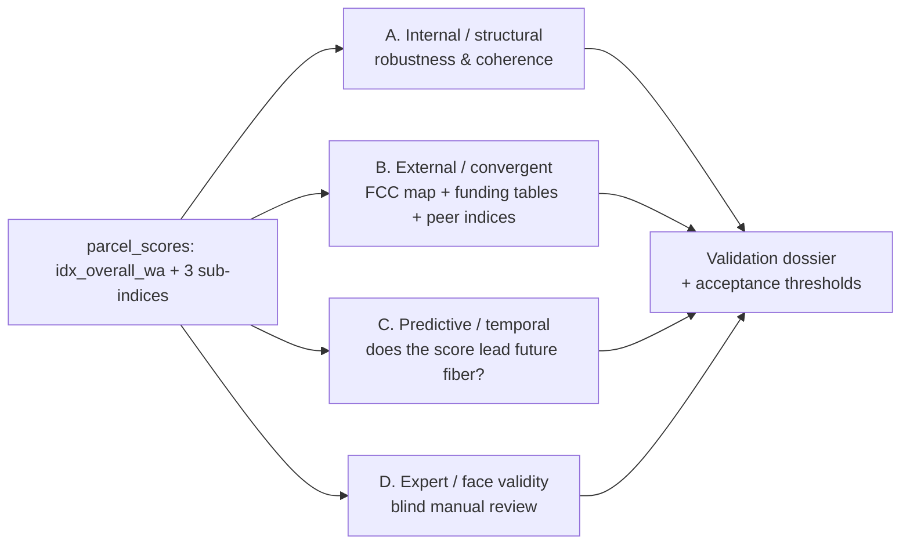

# Validation Methodology — Parcel-Level Fiber Potential Index

## 0. The core problem

We produced a 0–100 *fiber opportunity* score for every US parcel (`idx_overall_wa`,
plus `idx_growth` / `idx_telecom` / `idx_demo` sub-indices) by taking 13 features
across three buckets (growth @ parcel, FCC @ block, demo @ tract), weighting them by
mean(|SHAP|) from a LightGBM classifier, and combining as a weighted average of
sub-indices. See [weightage_methodology.MD](weightage_methodology.MD) and
[parcel_scoring_qa.md](parcel_scoring_qa.md).

There is **no observed label** for "fiber potential." This is the defining feature of
a *composite indicator* (a.k.a. composite index): it measures a latent construct that
cannot be directly observed. The validation literature for composite indicators is
therefore the right lens — not classical supervised-model validation (there is no test
set with a `y`).

The consequence, stated plainly: **we cannot compute accuracy.** What we *can* do is
accumulate multiple independent lines of evidence that the index (a) is statistically
coherent and stable, (b) agrees with external proxies that *should* correlate with
fiber opportunity, (c) predicts things that happen *after* the index is built, and
(d) matches expert judgment on concrete parcels. This is the standard "construct
validity" argument — no single test proves the index, but convergent evidence from
independent tests makes it credible.

---

## 1. Literature & precedent (with sources)

### 1.1 Composite-indicator validation — the governing framework

- **OECD & JRC (2008), *Handbook on Constructing Composite Indicators: Methodology and
  User Guide*** (Nardo, Saisana, Saltelli, Tarantola et al.). This is the canonical
  reference. Its 10-step process treats validation as two pillars:
  (Step 8) **uncertainty and sensitivity analysis** — vary every subjective
  construction choice (normalization, weights, aggregation) and measure how much the
  ranks move; and (Step 10) **links to other indicators** — correlate the composite
  against external variables it should relate to.
  PDF: <https://www.oecd.org/content/dam/oecd/en/publications/reports/2008/08/handbook-on-constructing-composite-indicators-methodology-and-user-guide_g1gh9301/9789264043466-en.pdf>
  - Key quote (paraphrased): a composite is *robust* only if country/unit ranks are
    stable across plausible alternative methodological choices; "sensitivity analysis
    is considered a necessary element of quality assurance."

- **Saisana, Saltelli & Tarantola (2005), "Uncertainty and sensitivity analysis
  techniques as tools for the quality assessment of composite indicators," *J. Royal
  Statistical Society A* 168(2):307–323.** Establishes that the *rank* of a unit should
  be reported with an uncertainty band derived from Monte-Carlo variation of the
  construction choices. DOI: 10.1111/j.1467-985X.2005.00350.x

- **Nardo et al. / JRC "Competence Centre on Composite Indicators and Scoreboards"** —
  ongoing methodological hub: <https://composite-indicators.jrc.ec.europa.eu/>

- **Construct validity (the underlying epistemology): Cronbach & Meehl (1955),
  "Construct validity in psychological tests," *Psychological Bulletin* 52(4):281–302.**
  Defines the three tests we lean on below: **convergent** validity (agrees with
  measures of the same construct), **criterion** validity (predicts an external
  outcome), and **face** validity (experts judge it reasonable).

### 1.2 Broadband / digital-divide indices we can benchmark against

- **Purdue Center for Regional Development — Digital Divide Index (DDI)** (Gallardo).
  A well-known composite (0–100) built from infrastructure/adoption + socioeconomic
  components at county and tract level. Directly citable as a peer index for
  *convergent validity* and as a template for how a broadband composite is documented.
  <https://pcrd.purdue.edu/ruraldevelopment/digital-divide-index/>
- **National Digital Inclusion Alliance (NDIA)** digital-equity indicators and the
  "worst-connected cities" rankings — another external cross-reference.
  <https://www.digitalinclusion.org/>
- **Microsoft/academic broadband-usage estimates** and the recurring finding that FCC
  availability data historically *overstates* coverage — relevant caveat when we use
  FCC data as an anchor.

### 1.3 SHAP-as-weights — validity of the weighting scheme

- **Lundberg & Lee (2017), "A Unified Approach to Interpreting Model Predictions,"
  *NeurIPS*.** SHAP values are the Shapley-value attribution of a prediction to each
  feature; mean(|SHAP|) is a consistent global importance measure. arXiv:1705.07874
- **Lundberg et al. (2020), *Nature Machine Intelligence* 2:56–67**, "From local
  explanations to global understanding with explainable AI for trees." Justifies using
  tree-SHAP importances aggregated globally — but note SHAP measures importance *to the
  model*, not causal importance to fiber build-out. This is exactly why the weighting
  choice must be stress-tested in §3.A.

> **Takeaway from the literature:** validate along four independent axes —
> **structural/statistical robustness**, **external convergent/criterion agreement**,
> **temporal/predictive power**, and **expert face validity**. No single axis is
> sufficient; the argument is cumulative.

---

## 2. Validation framework overview

Each axis below lists: **the idea**, **the data**, **the metric**, and a **pass
criterion** you can put in a report.

---

## 3. Axis A — Internal / structural validation (no external data needed)

This is Step 8 of the OECD/JRC handbook. It answers: *"Is the index an artifact of our
arbitrary construction choices?"*

### A1. Uncertainty & sensitivity analysis (the single most important test)
Re-run scoring under a grid of defensible alternatives and measure how much parcel
**ranks** move:

- **Weights:** SHAP weights vs. equal weights; LightGBM-SHAP vs. the earlier RF-SHAP;
  ±1 SE perturbation of each weight; and the two aggregation schemes already debated in
  [weightage_methodology.MD](weightage_methodology.MD) (all-13 direct vs.
  weighted-average-of-sub-indices).
- **Normalization:** min-max vs. rank/percentile (already flagged as an open decision).
- **Aggregation:** linear (current) vs. geometric mean (penalizes imbalance across
  buckets — recommended by the handbook when compensability is a concern).
- **NA fills:** the `1.25×max` hotspot fill and P99 fiber-distance cap (both flagged as
  tunable in [parcel_scoring_qa.md](parcel_scoring_qa.md) G1/G2/F4).

**Metric:** for a stratified sample of parcels, report median and 90% interval of the
**rank shift** (in percentile points) across all scenarios; and average
**Spearman ρ** and **rank-biased overlap** between the baseline and each variant.
**Pass criterion (suggested):** median absolute rank shift < 5 percentile points and
Spearman ρ > 0.95 against the baseline for the *decile* assignment that customers see.
Report the parcels/segments where ranks are *unstable* — those are the ones to caveat.

### A2. Internal coherence / redundancy of the structure
- **Sub-index correlation matrix** (Pearson + Spearman). The methodology doc already
  noted growth–overall ρ = 0.946 under the old scheme — quantify this for the shipped
  weighted-average scheme and confirm no single bucket dominates `idx_overall_wa`.
- **Cronbach's α** across the three sub-indices as a coherence check (are they measuring
  a shared construct, or fighting each other?). Very low α ⇒ the buckets are unrelated
  and the overall is a mash-up; very high α ⇒ redundant buckets.
- **Correlation vs. weight consistency:** a feature's empirical correlation with the
  overall should roughly track its assigned weight; large mismatches (e.g., a
  low-weight feature that drives the index via high variance) are the "variance
  dominance" pathology already noted for hotspot distance.

### A3. Spatial coherence
Fiber opportunity should be spatially smooth (adjacent parcels share reality) but not
*trivially* constant.
- **Global Moran's I** on `idx_overall_wa` at block/tract level: expect significant
  positive autocorrelation (contiguity should exist) but I well below 1.
- **Local Moran's I / LISA** to surface hot/cold-spot clusters and, importantly,
  spatial **outliers** (a high-score parcel surrounded by low) — those are prime
  candidates for the manual review in §5.
- Cross-check against the degenerate-block QC already required (F5): confirm
  uninhabited/water blocks with `census_housing_units = 0` are not producing inflated
  FCC sub-index scores.

### A4. Face-plausibility of the distribution
Sanity histograms and choropleths by density tier (urban/suburban/exurban/rural, per
the tiers in [distance_methodology_semivariogram.md](distance_methodology_semivariogram.md)):
established fiber metros should skew low on *opportunity*; fast-growing exurban fringe
should skew high. A U-shaped or degenerate distribution is a red flag.

---

## 4. Axis B — External convergent & criterion validation (FCC + funding)

This is where your requested FCC sources come in. The critical framing: **each external
dataset is a *proxy*, not ground truth**, and each proxy has a known bias. Use several,
expect *directional* agreement, and be explicit about what each one can and cannot
confirm.

### B1. FCC National Broadband Map / Broadband Data Collection (BDC)
Source: <https://broadbandmap.fcc.gov/> and <https://www.fcc.gov/BroadbandData>.
Location-level (Broadband Serviceable Location Fabric) availability by technology and
speed, updated ~twice a year.

- **Use 1 — construct check (concurrent):** parcels that *already* have fiber
  (`fiber_location_count > 0`, 1000/100 tier) should generally score **low** on
  opportunity (the index rewards greenfield/underserved). Confirm the expected negative
  association between existing-fiber availability and `idx_overall_wa`. This is partly
  circular (FCC features feed the index) so treat it as a *consistency* check, not
  independent evidence.
- **Use 2 — the strong test (temporal, see §4-note):** take an *older* Fabric vintage,
  build the index on it, then check whether **new fiber that appeared in a later
  vintage** landed disproportionately in high-scoring parcels. That is genuine
  predictive validity (§ Axis C).
- **Caveat to document:** the FCC availability data has historically overstated
  coverage (provider self-report + challenge process). Use the challenge-corrected /
  latest published Fabric and note residual error.

### B2. FCC / NTIA funding tables — the best "quasi-ground-truth" for *opportunity*
Where public/private capital is actually flowing toward fiber is the closest observable
analog to "fiber potential." Recommended tables:

- **BEAD (NTIA, $42.45B)** — eligible **unserved** (<25/3) and **underserved**
  (<100/20) locations, and, increasingly, awarded/subgrantee deployment areas.
  <https://broadbandusa.ntia.gov/funding-programs/broadband-equity-access-and-deployment-bead-program>
  and the state/territory progress dashboard. BEAD-eligible locations are, almost by
  definition, high fiber *need*; check that they concentrate in the upper deciles of the
  FCC/demo sub-indices.
- **RDOF — Rural Digital Opportunity Fund (Auction 904)** — FCC location-level
  eligible + winning-bid areas, with the winning technology tier. FCC auction/RDOF data:
  <https://www.fcc.gov/auction/904>. Fiber-tier RDOF wins are places a bidder committed
  to build gigabit service — a market signal of opportunity.
- **CAF II / earlier Connect America Fund** deployments — historical build commitments,
  useful for the temporal test (did funded areas get built, and did we score them high
  *before* the build?).
- (Adjacent, adoption not deployment) **ACP enrollment** and **Census ACS** digital
  variables — useful for the demo sub-index cross-check, not for the fiber-build claim.

**Metric for B1/B2:** treat "is this location BEAD-eligible / RDOF-fiber-won / newly
fibered" as a binary and compute **AUROC / AUPRC** of `idx_overall_wa` (and each
sub-index) against it; plus a **decile-lift chart** (share of funded/eligible locations
captured in the top decile vs. random). Report **rank correlation** where the external
signal is continuous (e.g., dollars/location).
**Pass criterion (suggested):** AUROC ≥ 0.70 for at least one external anchor and a
top-decile lift ≥ 2× for the relevant sub-index, with the *direction* of every
association matching the prior stated up front.

> **Honesty guardrail:** BEAD/RDOF target *unserved rural* areas, so they correlate with
> the FCC+demo buckets far more than with the *growth* bucket. Do **not** expect the
> growth sub-index to predict BEAD eligibility — that mismatch is expected, and
> pretending otherwise would be a validity failure, not a success. Validate each
> sub-index against the anchor that matches its construct.

### B3. Convergent validity vs. peer indices
Correlate `idx_overall_wa` (and sub-indices) against the **Purdue Digital Divide Index**
and NDIA indicators at shared geographies (county/tract). Expect **moderate** positive
correlation with the "infrastructure gap" side and moderate *negative* with the
"already-connected" side. Perfect correlation would mean we built nothing new; zero
correlation would mean we're measuring noise. Report Spearman ρ with confidence
intervals and interpret the *magnitude* against these priors.

---

## 5. Axis D — Expert / manual review (face validity)

The literature calls this face validity; operationally it is a **blind, structured
audit** with measurable inter-rater agreement, not an ad-hoc "looks right."

### Design
1. **Sampling frame:** stratified by (a) score decile, (b) density tier, (c) region,
   and (d) the **disagreement cases** surfaced by Axes A–B (spatial outliers from A3,
   parcels where the index and FCC/funding proxies disagree). Oversample the tails and
   the disagreements — that is where an index breaks. ~300–500 parcels is enough for
   stable kappa if strata are balanced.
2. **Blind protocol:** reviewers see the parcel, its raw features, aerial/streetview,
   local context (existing providers, nearby development) — but **not** the model score.
   Each reviewer independently rates fiber opportunity on the same 1–5 (or
   low/med/high) scale, with a short written rationale.
3. **Then reveal** the index and compute agreement.

### Metrics
- **Spearman ρ / weighted Cohen's κ (2 raters) or Fleiss' κ (3+)** between expert rating
  and index decile.
- **Inter-rater reliability among the humans themselves** — if experts don't agree with
  *each other*, the construct is ill-defined and no index can match it; this bounds the
  achievable agreement.
- **Structured error taxonomy:** for every large disagreement, tag the cause (bad
  feature value, wrong grain broadcast, NA-fill artifact per G1, stale FCC vintage,
  genuine model gap). This feeds directly back into the pipeline QC in
  [parcel_scoring_qa.md](parcel_scoring_qa.md).

**Pass criterion (suggested):** expert–index weighted κ ≥ 0.4 (moderate) *and*
expert–index κ not materially below expert–expert κ (i.e., the index is about as close
to each expert as the experts are to each other).

---

## 6. Axis C — Predictive / temporal validation (the strongest single test)

Because there's no static label, **time provides one for free.** If the index has real
signal, a score computed on vintage *t* should predict fiber-relevant outcomes observed
at *t+1*.

- **Build-out prediction:** score parcels on the FCC Fabric / feature vintage from an
  earlier release; measure whether **newly reported fiber** (later National Broadband
  Map vintage) and **new funding awards** (BEAD/RDOF authorizations after *t*)
  concentrate in high-score parcels. Report AUROC + decile lift as in B2, but now with
  strict temporal separation (no leakage from post-*t* data into the score).
- **Development follow-through:** for the growth sub-index specifically, check whether
  parcels flagged high-growth at *t* show *actual* new permits / housing units at *t+1*
  (CoreLogic/Census), validating the growth proxy independent of fiber.
- **Back-testing note:** this requires snapshotting an older feature vintage. If historic
  vintages aren't retained, start archiving `run_id` feature+score snapshots now so this
  test is possible at the next FCC release — it is the most defensible evidence you can
  produce.

**Pass criterion (suggested):** temporally-separated AUROC ≥ 0.65 for future fiber /
future funding, materially above the concurrent-baseline reshuffle (permutation null).

---

## 7. Putting it together — acceptance dossier

No single number "passes." Assemble a **validation dossier** reporting all four axes,
each with its metric, threshold, and result, plus an explicit **known-limitations**
section. Suggested headline scorecard:

| Axis | Test | Metric | Suggested threshold |
|------|------|--------|--------------------|
| A | Sensitivity (weights/norm/aggr) | median rank shift; Spearman ρ | < 5 pts; ρ > 0.95 |
| A | Sub-index redundancy | corr matrix; Cronbach α | no bucket ρ>0.9 w/ overall |
| A | Spatial coherence | Moran's I (+LISA) | I positive & significant, < ~0.7 |
| B | FCC map concurrent | assoc. w/ existing fiber | sign matches prior |
| B | BEAD/RDOF funding | AUROC; top-decile lift | ≥0.70; ≥2× (matched bucket) |
| B | Peer index (Purdue DDI) | Spearman ρ | moderate, sign matches prior |
| C | Future fiber / funding | temporal AUROC | ≥0.65, > permutation null |
| D | Blind expert review | weighted κ vs. experts | ≥0.4 and ≈ expert–expert κ |

## 8. Threats to validity to state explicitly (don't hide these)

- **Circularity:** FCC features are *inputs* to the index, so FCC-derived anchors give
  partly self-fulfilling agreement. Lean on the *funding* tables and *temporal* tests
  for the independent evidence; label the concurrent FCC-map check as consistency only.
- **Proxy–construct gap:** BEAD/RDOF measure *policy-defined need in rural areas*, not
  *commercial fiber-build ROI*. They validate the FCC/demo buckets, not growth.
- **FCC coverage overstatement** and challenge-process churn between vintages.
- **Grain broadcasting:** demo@tract and FCC@block are broadcast to parcels; validation
  metrics computed at parcel level inherit within-tract/within-block homogeneity — also
  report metrics aggregated at the native grain to avoid over-stating resolution.
- **Modifiable Areal Unit Problem (MAUP):** results can shift with the aggregation unit;
  report key external correlations at more than one geography (block, tract, county).

## 9. Suggested phasing (mapped to this repo)

1. **Phase 1 — internal (fast, no new data):** Axis A on the existing
   `teu_outputs.parcel_scores`; add a `notebooks/05_validation_sensitivity.ipynb` and a
   `src/network_idx/eda/` sensitivity module reusing `scoring/parcel_score.py` variants.
2. **Phase 2 — external anchors:** ingest BEAD-eligible + RDOF + latest Fabric to BQ
   (mirror the `transfer/` pattern); compute AUROC/lift in
   `notebooks/05_validation_external.ipynb`.
3. **Phase 3 — expert review:** build the stratified sample table (oversample A/B
   disagreements), run the blind protocol, compute κ.
4. **Phase 4 — temporal:** snapshot the current `run_id` now; re-score against the next
   FCC vintage and measure predictive lift.

---

### Primary sources
- OECD/JRC (2008) *Handbook on Constructing Composite Indicators* — <https://www.oecd.org/content/dam/oecd/en/publications/reports/2008/08/handbook-on-constructing-composite-indicators-methodology-and-user-guide_g1gh9301/9789264043466-en.pdf>
- Saisana, Saltelli & Tarantola (2005), *JRSS A* 168(2):307–323, DOI 10.1111/j.1467-985X.2005.00350.x
- Cronbach & Meehl (1955), *Psychological Bulletin* 52(4):281–302
- Lundberg & Lee (2017), *NeurIPS*, arXiv:1705.07874; Lundberg et al. (2020) *Nat. Mach. Intell.* 2:56–67
- Purdue PCRD Digital Divide Index — <https://pcrd.purdue.edu/ruraldevelopment/digital-divide-index/>
- FCC National Broadband Map / BDC — <https://broadbandmap.fcc.gov/>, <https://www.fcc.gov/BroadbandData>
- NTIA BEAD — <https://broadbandusa.ntia.gov/funding-programs/broadband-equity-access-and-deployment-bead-program>
- FCC RDOF (Auction 904) — <https://www.fcc.gov/auction/904>
- JRC Competence Centre on Composite Indicators — <https://composite-indicators.jrc.ec.europa.eu/>
